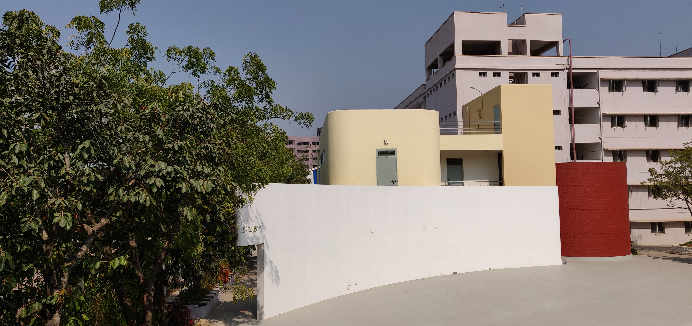
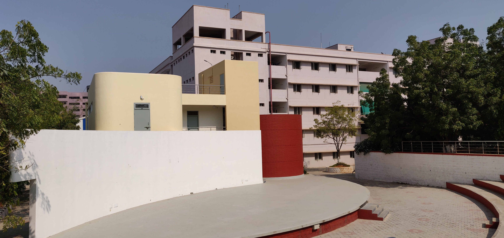
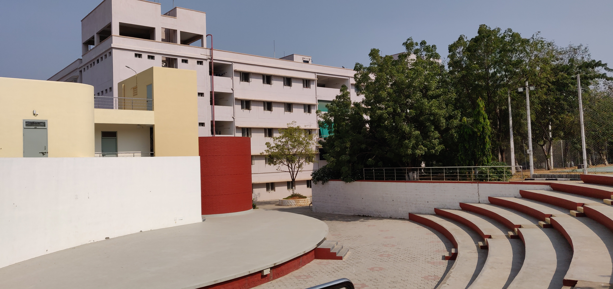
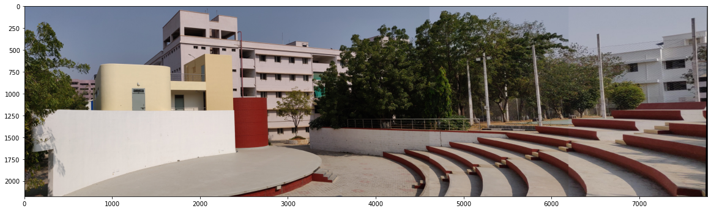

# Creating Image panorama

## Introduction
Image Mosaicing or photo stitching is the process of combining multiple photographic images with overlapping fields of view to produce a single high-resolution image. 

## Screenshots
### Image1
  
### Image2

### Image3

### Combined_Image (Single Panorama)

## Working
First the algorithm computes the keypoints and there descriptors for each pair of images using the SIFT algorithm. The descriptors of the two images are then compared for closeness according to algorithm of choice. The keypoints of the matched descriptors are then used to calculate a projection matrix using RANSAC algorithm for projecting keypoints from image1 to image2. This projection matrix is then used to stitch the two images together by projecting one image into another image's frame of reference.

## Prerequisites
* Python Packages :-
    *  opencv-contrib-python, version = 4.4.0.44
    * numpy
    * matplotlib
    * cv2
    * random
    * math

## Notebook link
https://colab.research.google.com/drive/1GDjI_ic5OlB-GbmdO9VI-fH6VF7xeRMJ#scrollTo=wgvI2hehjj0d